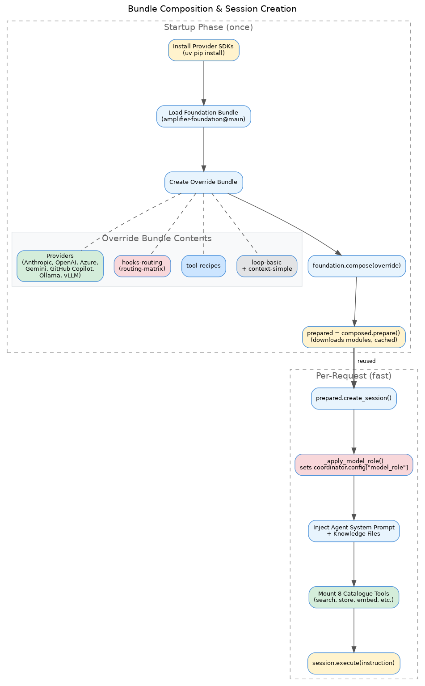
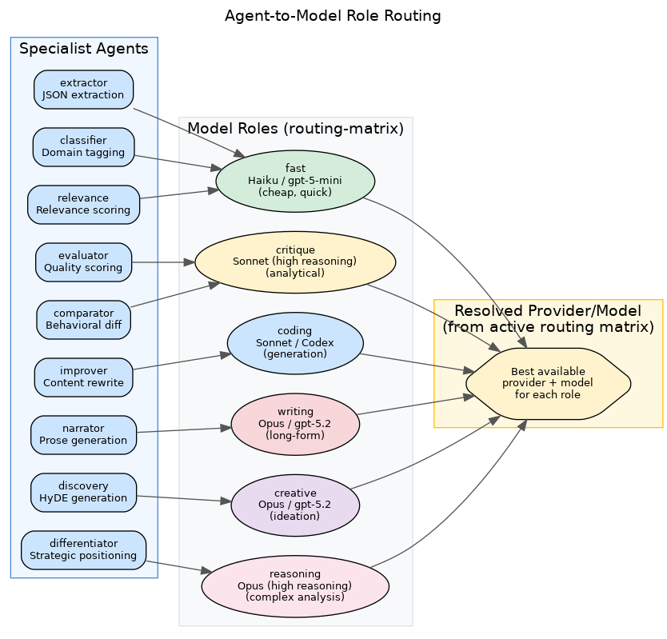
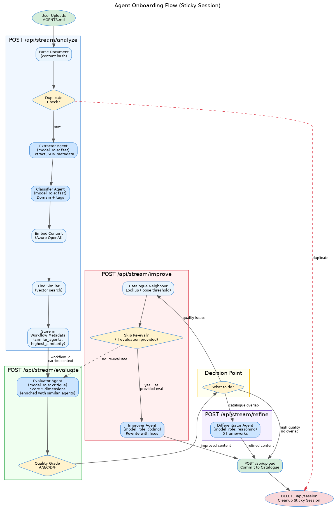
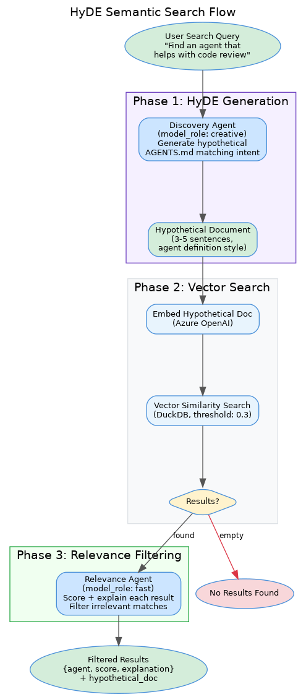
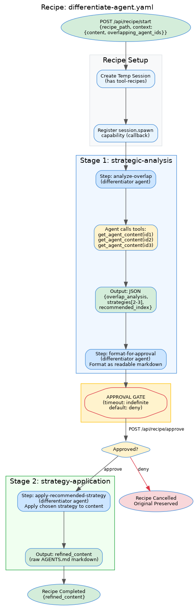

# Agent Catalogue

A web application for cataloguing, versioning, and discovering AI agent definitions (AGENTS.md files), powered by [Amplifier](https://github.com/microsoft/amplifier).

**Live Repository**: https://github.com/colombod/amplifier-agent-catalogue

---

## What It Does

Agent Catalogue helps you manage and discover AI agent definitions:

- **Upload & Analyze** - Extract metadata from AGENTS.md files
- **Quality Evaluation** - Grade agent definitions (A-F scale)
- **Similarity Detection** - Find overlapping agents in the catalogue
- **Smart Differentiation** - AI-powered positioning strategies to reduce overlap
- **Version Management** - Track agent evolution over time
- **Semantic Search** - Find agents by capabilities, domains, or purpose

---

## Architecture

### Tech Stack

- **Backend**: FastAPI + Amplifier (AI agent framework)
- **Storage**: DuckDB (embedded database with vector search)
- **Embeddings**: Azure OpenAI (text-embedding-3-large)
- **LLM**: Anthropic Claude (via Amplifier providers)
- **Frontend**: HTML/JavaScript + SSE for real-time updates

### Key Components

**Amplifier Integration**:
- **SessionManager** - Orchestrates AI workflows with sticky session support
- **5 specialist agents** - extractor, classifier, evaluator, improver, differentiator
- **8 custom catalogue tools** - search_similar, get_agent_content, store_agent, etc.
- **SSE Bridge** - Streams Amplifier kernel events to web UI in real-time
- **Recipes bundle** - Multi-step workflows with approval gates

**Sticky Workflow Sessions** (NEW):
- Single Amplifier session persists across all agents in upload workflow
- Context accumulates: each agent sees prior agents' work
- Workflow metadata preserved: similarity scores, overlap analysis
- Automatic cleanup on success/cancel/navigation

**API Architecture**:
- **REST endpoints** - CRUD operations (list, get, search, store)
- **Streaming endpoints (SSE)** - Real-time agent execution with event streaming
- **Recipe endpoints** - Multi-stage workflows with approval gates
- **Session cleanup** - DELETE /api/session/{workflow_id} for resource management

---

## Features

### 1. Real-Time Analysis with SSE Streaming

**Live feedback** during agent execution:
- Watch AI reasoning in real-time (thinking blocks visible)
- See tool calls as they execute (search_similar, get_agent_content)
- Track progress through workflow phases
- Model info displayed: `anthropic (claude-sonnet-4-5-20250929)`

### 2. Sticky Workflow Sessions

**Context accumulates** across all agents in a workflow:
- Single Amplifier session persists from upload → evaluation → improvement
- Each agent sees what prior agents said and did
- Eliminates redundant analysis work
- More intelligent decision-making with full history

### 3. Cross-Stage Metadata Flow

**Analysis results preserved** across workflow stages:
- Similarity scores calculated once in step 2
- Evaluator receives overlap context when scoring differentiation
- Differentiator has access to stored similarity data
- Improver gets pre-computed catalogue landscape (no redundant searches)

### 4. Upload & Analysis

Upload an AGENTS.md file and get:
- Extracted metadata (name, capabilities, domains, tools, complexity)
- Automatic classification
- Similar agents detection (vector similarity)
- Quality evaluation with actionable feedback

### 5. Quality Improvement

AI-powered quality improvement:
- Identifies clarity, specificity, structure issues
- Suggests concrete fixes (with location and severity)
- Preserves your agent's core purpose
- Issues auto-expanded for review
- Shows before/after quality grade badge

---

## API Endpoints

### Core Endpoints

| Endpoint | Method | Purpose |
|----------|--------|---------|
| `/api/agents` | GET | List all agents |
| `/api/agents/{slug}` | GET | Get specific agent |
| `/api/analyze` | POST | Extract metadata & find similar |
| `/api/evaluate` | POST | Quality evaluation |
| `/api/improve` | POST | AI-powered improvement |
| `/api/refine` | POST | Differentiation (Pattern 1) |
| `/api/search` | GET | Semantic search |

### Recipe Endpoints (Pattern 2) ✅

| Endpoint | Method | Purpose | Status |
|----------|--------|---------|--------|
| `/api/recipe/start` | POST | Start recipe execution | ✅ Implemented |
| `/api/recipe/status/{session_id}` | GET | Poll recipe status | ✅ Implemented |
| `/api/recipe/sessions` | GET | List all recipe sessions | ✅ Implemented |
| `/api/recipe/approvals` | GET | List pending approvals | ✅ Implemented |
| `/api/recipe/approve` | POST | Approve/deny stage | ✅ Implemented |
| `/api/recipe/cancel/{session_id}` | POST | Cancel execution | ✅ Implemented |

### Streaming Endpoints (SSE) - Real-Time Agent Execution

All streaming endpoints support sticky sessions via optional `workflow_id`:

| Endpoint | Purpose | Supports Sticky |
|----------|---------|-----------------|
| `/api/stream/analyze` | Extract metadata + find similar agents | ✅ |
| `/api/stream/evaluate` | Quality evaluation with enriched context | ✅ |
| `/api/stream/refine` | Strategic differentiation | ✅ |
| `/api/stream/improve` | AI-powered improvement with catalogue context | ✅ |

**Sticky session benefits:**
- Context accumulates across agents
- Metadata preserved (similarity scores, overlap analysis)
- No redundant catalogue searches
- Automatic cleanup on completion

### Session Management

| Endpoint | Method | Purpose |
|----------|--------|---------|
| `DELETE /api/session/{workflow_id}` | DELETE | Cleanup sticky session |

---

## Getting Started

### Prerequisites

- **Python 3.11+**
- **Azure OpenAI** access (for embeddings)
- **Anthropic API key** (for AI agents)
- **uv** package manager ([install here](https://docs.astral.sh/uv/))

### Quick Start

```bash
# 1. Clone repository
git clone https://github.com/colombod/amplifier-agent-catalogue.git
cd amplifier-agent-catalogue

# 2. Install dependencies
uv sync

# 3. Configure providers and settings
agent-catalogue init

# 4. Start the server
uv run agent-catalogue serve

# 5. Open http://localhost:8000
```

### Provider Configuration (`agent-catalogue init`)

The `init` command is a guided setup wizard that configures LLM providers,
embeddings, and server settings. Run it before starting the server for the
first time.

**Interactive mode** (recommended):

```bash
agent-catalogue init
```

This walks you through three steps:

**Step 1: Provider** - Installs available Amplifier providers from GitHub
(`provider-anthropic`, `provider-openai`, `provider-azure-openai`) and lets you
pick one. Each provider declares its own config fields, so the prompts adapt
automatically:

- **Anthropic**: Prompts for API key, then lists available models to choose from
- **OpenAI**: Prompts for API key (and optional base URL), then lists models
- **Azure OpenAI**: Prompts for endpoint, API key or RBAC auth, deployment name

API keys are stored securely via the key manager (`~/.agent-catalogue/keys.yaml`)
and referenced as `${VAR_NAME}` placeholders in settings.

**Step 2: Embeddings** - Configures the Azure OpenAI embedding model used for
vector similarity search:

```
Azure OpenAI endpoint for embeddings: https://your-instance.cognitiveservices.azure.com/
Embedding deployment name [text-embedding-3-large]:
Embedding model name [text-embedding-3-large]:
Embedding dimensions [3072]:
Embedding auth method (rbac/api_key) [rbac]:
```

**Step 3: Server** - Sets host, port, and debug mode (defaults: `127.0.0.1:8000`).

Settings are saved to `~/.agent-catalogue/settings.yaml`.

**Non-interactive mode** (for CI or scripted setup):

```bash
# Set credentials in environment first
export ANTHROPIC_API_KEY=sk-ant-...
# Or for Azure OpenAI:
# export AZURE_OPENAI_API_KEY=... AZURE_OPENAI_ENDPOINT=...

# Run with --yes to auto-detect provider from env vars
agent-catalogue init --yes
```

The `--yes` flag detects which provider to use based on environment variables
(`ANTHROPIC_API_KEY`, `OPENAI_API_KEY`, or `AZURE_OPENAI_API_KEY` +
`AZURE_OPENAI_ENDPOINT`) and configures it without prompts.

**Verify your configuration:**

```bash
agent-catalogue config
```

This displays all settings files, configured providers, embedding settings,
storage path, and server configuration.

### Configuration

All configuration is handled by `agent-catalogue init`. Settings are stored in
a layered YAML system (higher layers override lower):

| Scope | Path | Purpose |
|-------|------|---------|
| Global | `~/.agent-catalogue/settings.yaml` | User defaults |
| Project | `.agent-catalogue/settings.yaml` | Team-shared (committed) |
| Local | `.agent-catalogue/settings.local.yaml` | Machine-specific (gitignored) |

API keys are stored separately in `~/.agent-catalogue/keys.yaml` and injected
via `${VAR_NAME}` placeholders.

#### Supported Providers

| Provider | Required Credentials | Env Vars |
|----------|---------------------|----------|
| **Anthropic** | API key | `ANTHROPIC_API_KEY` |
| **OpenAI** | API key | `OPENAI_API_KEY` |
| **Azure OpenAI** | Endpoint + API key or RBAC | `AZURE_OPENAI_API_KEY`, `AZURE_OPENAI_ENDPOINT` |

Providers are installed from GitHub automatically during `agent-catalogue init`.

#### Embeddings

The catalogue uses Azure OpenAI embeddings for vector similarity search.
Configure during `init` Step 2, or set environment variables:

```bash
# Azure OpenAI - For vector embeddings (used by init --yes)
AZURE_OPENAI_EMBEDDING_ENDPOINT=https://your-instance.cognitiveservices.azure.com/
AZURE_OPENAI_EMBEDDING_API_KEY=your-api-key  # if not using RBAC
```

#### Example Settings File

After running `agent-catalogue init`, your `~/.agent-catalogue/settings.yaml`
will look like:

```yaml
providers:
  - module: provider-anthropic
    config:
      api_key: ${ANTHROPIC_API_KEY}
      default_model: claude-sonnet-4-5-20250929
      priority: 1
embeddings:
  endpoint: https://your-instance.cognitiveservices.azure.com/
  deployment: text-embedding-3-large
  model: text-embedding-3-large
  dimensions: 3072
  api_version: 2024-12-01-preview
  auth: rbac
storage:
  db_path: ./data/catalogue.duckdb
server:
  host: 127.0.0.1
  port: 8000
  debug: false
```

---

## Usage

### Start Server

```bash
# Development
agent-catalogue serve

# Production
agent-catalogue serve --host 0.0.0.0 --port 8000
```

### Web Interface

Open http://localhost:8000

**Workflow**:
1. Upload AGENTS.md file
2. Review extracted metadata and similar agents
3. Get quality evaluation
4. Improve if needed
5. Differentiate if overlaps detected
6. Store in catalogue

### CLI Commands

```bash
# Configure providers, embeddings, and server (run once)
agent-catalogue init [--yes]

# Start web server
agent-catalogue serve [--host HOST] [--port PORT] [--reload]

# Show current configuration
agent-catalogue config
```

---

## Development

### Project Structure

```
amplifier-app-agent-catalogue/
├── src/agent_catalogue/
│   ├── api/              # FastAPI routes
│   │   ├── routes.py       # Core endpoints
│   │   └── recipes_routes.py  # Recipe endpoints
│   ├── models/           # Pydantic models
│   ├── services/         # Business logic
│   ├── storage/          # DuckDB repository
│   ├── tools/            # Amplifier catalogue tools
│   ├── web/              # Templates & static files
│   ├── session_manager.py  # Amplifier session orchestration
│   └── sse_bridge.py     # Real-time event streaming
├── agents/               # Amplifier agent definitions
├── context/              # Knowledge files for agents
├── recipes/              # Multi-step workflows
├── tests/                # Test suite
└── docs/                 # Documentation
```

### Running Tests

```bash
# Quick endpoint verification (fast, no LLM)
.venv/bin/python tests/test_recipe_endpoints_quick.py

# Filesystem helpers test
.venv/bin/python tests/test_recipe_helpers.py

# Full test suite (requires LLM, slower)
pytest tests/

# Code quality
ruff check src/ tests/
pyright src/ tests/
```

### Key Concepts

**Amplifier Integration**:
- Uses Amplifier's modular architecture (providers, tools, orchestrators, hooks)
- Loads `@recipes` bundle for multi-step workflows
- SessionManager creates isolated sessions per operation
- SSE bridge streams Amplifier kernel events to web UI

**Agent Specialists**:
- **extractor** - Extract metadata from AGENTS.md
- **classifier** - Classify domain and complexity
- **evaluator** - Quality grading (1-10 scale)
- **improver** - Fix quality issues
- **differentiator** - Strategic positioning

**Tools**:
- 8 custom catalogue tools for agent operations
- Mounted on each specialist session
- Enable agents to search, read, analyze catalogue

---

## Documentation

### Essential Docs

| Doc | Purpose |
|-----|---------|
| **[README.md](README.md)** | Project overview (this file) |
| **[docs/USER_GUIDE.md](docs/USER_GUIDE.md)** | How to use the web interface |
| **[docs/API.md](docs/API.md)** | Complete API reference |
| **[docs/ARCHITECTURE.md](docs/ARCHITECTURE.md)** | System design & technical details |

### Technical Details

| Doc | Purpose |
|-----|---------|
| **[docs/DIFFERENTIATION_PATTERNS.md](docs/DIFFERENTIATION_PATTERNS.md)** | Pattern 1 vs 2 comparison |
| **[docs/EVENT_FLOW.md](docs/EVENT_FLOW.md)** | SSE event architecture |
| **[tests/README.md](tests/)** | Testing guide |

### Context Files (for agents)

| Directory | Purpose |
|-----------|---------|
| **[agents/](agents/)** | 9 specialist agent definitions |
| **[context/](context/)** | Knowledge files loaded by agents |
| **[recipes/](recipes/)** | Multi-step workflow definitions |

### Archive

Historical implementation notes and superseded documentation in **[docs/archive/](docs/archive/)**

---

## Contributing

This is a personal project by @colombod. Issues and PRs welcome!

### Development Workflow

1. Create feature branch
2. Make changes with tests
3. Run quality checks
4. Commit with descriptive messages
5. Push and create PR

### Commit Message Format

```
type: short description

Longer explanation if needed.

🤖 Generated with Amplifier
Co-Authored-By: Amplifier <240397093+microsoft-amplifier@users.noreply.github.com>
```

Types: `feat`, `fix`, `docs`, `test`, `refactor`, `chore`

---

## Architecture Flow Diagrams

Visual documentation of the application's workflow and orchestration patterns.
Source DOT files are in [`docs/diagrams/`](docs/diagrams/) and can be re-rendered
with `dot -Tpng file.dot -o file.png`.

### Bundle Composition & Session Creation

How the Amplifier bundle is assembled at startup and how sessions are created
per-request. Shows the foundation bundle, override bundle (providers, routing
hook, tools), and the per-session lifecycle including `model_role` application.



### Agent-to-Model Role Routing

Each specialist agent is mapped to a semantic model role. The `hooks-routing`
hook resolves these roles to concrete provider/model pairs using the active
routing matrix (balanced, quality, economy, copilot, etc.).



### Agent Onboarding Flow (Sticky Session)

The primary multi-step workflow for uploading, analyzing, evaluating, improving,
and differentiating an AGENTS.md file. Uses sticky sessions so context
accumulates across all agents. Workflow metadata (similar agents, overlap
scores) is preserved across stages.



### HyDE Semantic Search Flow

The three-phase Hypothetical Document Embedding search pipeline:
1. **Discovery agent** generates a hypothetical AGENTS.md matching the query
2. **Vector search** finds similar agents using the hypothetical document's embedding
3. **Relevance agent** filters and explains results



### Recipe: Strategic Differentiation

The approval-gated recipe workflow for differentiating an agent from overlapping
catalogue entries. Stage 1 analyzes overlap and proposes strategies (with an
approval gate). Stage 2 applies the recommended strategy to produce a refined
AGENTS.md.



---

## License

[Add license information]

---

## Credits

Built with:
- [Amplifier](https://github.com/microsoft/amplifier) - AI agent framework
- [FastAPI](https://fastapi.tiangolo.com/) - Web framework
- [DuckDB](https://duckdb.org/) - Embedded database
- [Azure OpenAI](https://azure.microsoft.com/en-us/products/ai-services/openai-service) - Embeddings
- [Anthropic Claude](https://www.anthropic.com/) - Language model
